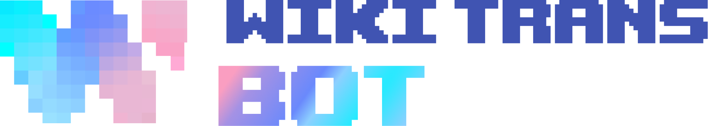
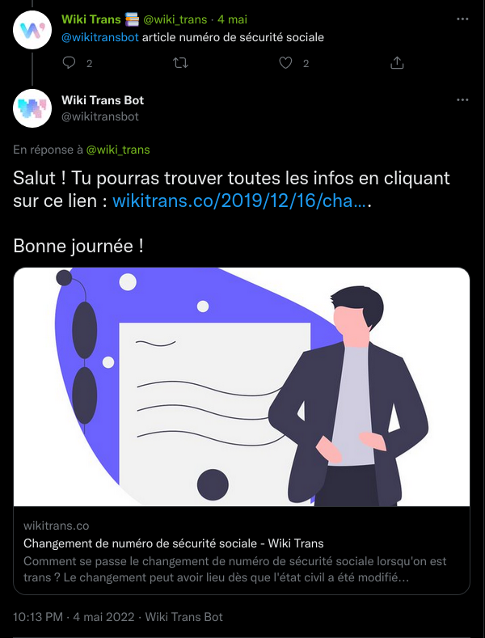

   

# Welcome to the offical Wikitransbot Github repo



## Description

This project is a Twitter Bot for the [Wikitrans website](www.wikitransbot.co) which allows any user to perform request from Twitter.

As of today, with the basic configuration, the bot will answer any tweet of the form `@wikitransbot article <keywords>` with an article matching the request.

Below is an example of a request to look for "article sécurité sociale" on Wikitrans.




## Configuration

A configuration template is provided in the repo. You can find it at the root of the project with the name `config_template.json`.

Here is its content:

```{
	"twitter": {
		"twitter_api_key": "twitter_api_key_placeholder",
		"twitter_api_key_secret": "twitter_api_key_secret_placeholder",
		"twitter_access_token": "twitter_access_token_placeholder",
		"twitter_access_token_secret": "twitter_access_token_secret_placeholder",
		"twitter_bearer_token": "twitter_bearer_token_placeholder",
		"user_id": "user_id_placeholder"
	},
	"last_id_file": "last_id_file_placeholder",
	"answer_template": [
		"Salut ! Tu pourras trouver toutes les infos en cliquant sur ce lien : %s.\n\nBonne journée !",
		"Je t'ai trouvé un article ici : %s.\n\nBonne journée !"
	],
	"no_answer_template": [
		"Désolé·e, je n'ai pas trouvé d'article correspondant à ta demande. \n\n Bonne journée !",
		"Je n'ai trouvé aucun article correspondant à ta demande, désolé·e !\n\n Bonne journée !"
	],
	"sleep_time": 60,
	"trigger_keyword": "article",
	"logfile_path": "logfile_path_placeholder",
	"stop_words": ["a", "à", "â", "abord", "afin", "ah", "ai", "aie", "ainsi", "allaient", "allo", "allô", "allons", "après", "assez", "attendu", "au", "aucun", "aucune", "aujourd", "aujourd'hui", "auquel", "aura", "auront", "aussi", "autre", "autres", "aux", "auxquelles", "auxquels", "avaient", "avais", "avait", "avant", "avec", "avoir", "ayant", "b", "bah", "beaucoup", "bien", "bigre", "boum", "bravo", "brrr", "c", "ça", "car", "ce", "ceci", "cela", "celle", "celle-ci", "celle-là", "celles", "celles-ci", "celles-là", "celui", "celui-ci", "celui-là", "cent", "cependant", "certain", "certaine", "certaines", "certains", "certes", "ces", "cet", "cette", "ceux", "ceux-ci", "ceux-là", "chacun", "chaque", "cher", "chère", "chères", "chers", "chez", "chiche", "chut", "ci", "cinq", "cinquantaine", "cinquante", "cinquantième", "cinquième", "clac", "clic", "combien", "comme", "comment", "compris", "concernant", "contre", "couic", "crac", "d", "da", "dans", "de", "debout", "dedans", "dehors", "delà", "depuis", "derrière", "des", "dès", "désormais", "desquelles", "desquels", "dessous", "dessus", "deux", "deuxième", "deuxièmement", "devant", "devers", "devra", "différent", "différente", "différentes", "différents", "dire", "divers", "diverse", "diverses", "dix", "dix-huit", "dixième", "dix-neuf", "dix-sept", "doit", "doivent", "donc", "dont", "douze", "douzième", "dring", "du", "duquel", "durant", "e", "effet", "eh", "elle", "elle-même", "elles", "elles-mêmes", "en", "encore", "entre", "envers", "environ", "es", "ès", "est", "et", "etant", "étaient", "étais", "était", "étant", "etc", "été", "etre", "être", "eu", "euh", "eux", "eux-mêmes", "excepté", "f", "façon", "fais", "faisaient", "faisant", "fait", "feront", "fi", "flac", "floc", "font", "g", "gens", "h", "ha", "hé", "hein", "hélas", "hem", "hep", "hi", "ho", "holà", "hop", "hormis", "hors", "hou", "houp", "hue", "hui", "huit", "huitième", "hum", "hurrah", "i", "il", "ils", "importe", "j", "je", "jusqu", "jusque", "k", "l", "la", "là", "laquelle", "las", "le", "lequel", "les", "lès", "lesquelles", "lesquels", "leur", "leurs", "longtemps", "lorsque", "lui", "lui-même", "m", "ma", "maint", "mais", "malgré", "me", "même", "mêmes", "merci", "mes", "mien", "mienne", "miennes", "miens", "mille", "mince", "moi", "moi-même", "moins", "mon", "moyennant", "n", "na", "ne", "néanmoins", "neuf", "neuvième", "ni", "nombreuses", "nombreux", "non", "nos", "notre", "nôtre", "nôtres", "nous", "nous-mêmes", "nul", "o", "o|", "ô", "oh", "ohé", "olé", "ollé", "on", "ont", "onze", "onzième", "ore", "ou", "où", "ouf", "ouias", "oust", "ouste", "outre", "p", "paf", "pan", "par", "parmi", "partant", "particulier", "particulière", "particulièrement", "pas", "passé", "pendant", "personne", "peu", "peut", "peuvent", "peux", "pff", "pfft", "pfut", "pif", "plein", "plouf", "plus", "plusieurs", "plutôt", "pouah", "pour", "pourquoi", "premier", "première", "premièrement", "près", "proche", "psitt", "puisque", "q", "qu", "quand", "quant", "quanta", "quant-à-soi", "quarante", "quatorze", "quatre", "quatre-vingt", "quatrième", "quatrièmement", "que", "quel", "quelconque", "quelle", "quelles", "quelque", "quelques", "quelqu'un", "quels", "qui", "quiconque", "quinze", "quoi", "quoique", "r", "revoici", "revoilà", "rien", "s", "sa", "sacrebleu", "sans", "sapristi", "sauf", "se", "seize", "selon", "sept", "septième", "sera", "seront", "ses", "si", "sien", "sienne", "siennes", "siens", "sinon", "six", "sixième", "soi", "soi-même", "soit", "soixante", "son", "sont", "sous", "stop", "suis", "suivant", "sur", "surtout", "t", "ta", "tac", "tant", "te", "té", "tel", "telle", "tellement", "telles", "tels", "tenant", "tes", "tic", "tien", "tienne", "tiennes", "tiens", "toc", "toi", "toi-même", "ton", "touchant", "toujours", "tous", "tout", "toute", "toutes", "treize", "trente", "très", "trois", "troisième", "troisièmement", "trop", "tsoin", "tsouin", "tu", "u", "un", "une", "unes", "uns", "v", "va", "vais", "vas", "vé", "vers", "via", "vif", "vifs", "vingt", "vivat", "vive", "vives", "vlan", "voici", "voilà", "vont", "vos", "votre", "vôtre", "vôtres", "vous", "vous-mêmes", "vu", "w", "x", "y", "z", "zut", "alors", "aucuns", "bon", "devrait", "dos", "droite", "début", "essai", "faites", "fois", "force", "haut", "ici", "juste", "maintenant", "mine", "mot", "nommés", "nouveaux", "parce", "parole", "personnes", "pièce", "plupart", "seulement", "soyez", "sujet", "tandis", "valeur", "voie", "voient", "état", "étions"]
}
```

You can find different sections:

- `twitter`
    - `twitter_api_key`: your Twitter API key
    - `twitter_api_key_secret`: your Twitter API key scret
    - `twitter_access_token`: your Twitter access token
    - `twitter_access_token_secret`: your Twitter access token secret
    - `twitter_bearer_token`: your Twitter bearer token
    - `user_id`: the user ID of your account
- `last_id_file`: the path to the file where the last checked tweet id (called since_id) is stored
 - `answer_template`: a list of templates for the bot to use when an article has been found
 - `no_answer_template`: a list of templates for the bot to use when no article has been found
 - `sleep_time`: the time between two runs, in seconds (60 is strongly adviced)
 - `trigger_keyword`: the keyword to use to ask the bot an article
 - `logfile_path`: the path to the logfile
 - `stop_words`: a list of words to ignore when performing a search

## Contributing

- To submit new issues, please do it in Github using the correct template if there is one. Before doing so, be sure your issue hasn't already been reported. For personnal support please send a mail to roelandt.jef@proton.me
- To contribute, fork the project and make a PR. Commits are expected to be atomics, functionnal and well-named. All features must be tested and must pass the CI.


## Authors

- Jef *"SuperMeepBoy"* Roelandt - roelandt.jef@proton.me

## License

[MIT](LICENSE)
